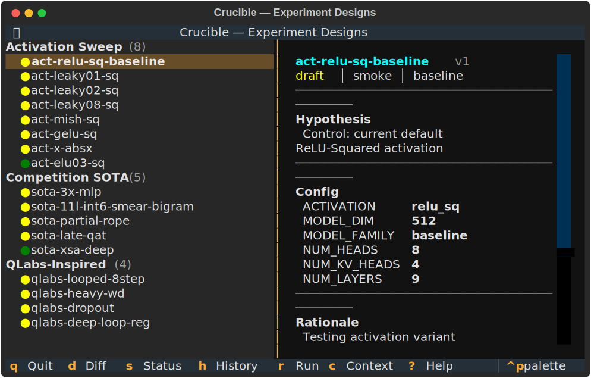

# Crucible

**ML research platform for autonomous experimentation on rental GPUs.**

Crucible combines LLM-driven hypothesis generation with fleet orchestration, versioned experiment designs, and an interactive TUI — all accessible over MCP so AI agents can design, run, and iterate on experiments autonomously.



---

## Key Features

### Versioned Experiment Designs
Every experiment design is a human-readable YAML file tracked with full version history. Agents iterate on designs, compare versions, and promote winners — all through MCP tools or the interactive TUI.

### 76 MCP Tools
Agents interact with Crucible over the Model Context Protocol. Browse experiments, generate hypotheses, design batches, compose architectures declaratively, run tree search over experiments, and trigger fleet runs — all without leaving the conversation.

### Interactive TUI
A Textual-powered terminal app for browsing designs, viewing diffs, cycling statuses, and exploring research context. Launch with `crucible tui`.


### Fleet Orchestration
Provision RunPod or SSH nodes, sync code, enqueue experiments, and collect results. Multi-tier promotion system: smoke (60s) to proxy (30m) to medium (1h) to promotion (2h).

### Autonomous Research Loop
Claude-driven hypothesis generation, batch design, fleet execution, and reflection. The researcher loop analyzes results, generates new hypotheses, and promotes or kills experiment branches automatically.

---

## Quick Start

```bash
# Install
pip install crucible-ml[all]

# Initialize project
crucible init

# Launch TUI
crucible tui

# Start MCP server (for Claude integration)
crucible mcp serve

# Run a smoke experiment
crucible run experiment --preset smoke
```

---

## Architecture

```
src/crucible/
  core/          Config, I/O, types, logging, version store
  fleet/         Provider-abstracted fleet (RunPod, SSH)
  runner/        Experiment execution, output parsing, presets
  training/      Training backends (torch) — factored from train_gpt.py
  models/        Model zoo — components, architectures, declarative composer
  researcher/    LLM-driven autonomous research loop
  analysis/      Leaderboard, sensitivity, Pareto frontier
  data/          Manifest-driven HuggingFace data pipeline
  mcp/           MCP server (64 tools for Claude agents)
  tui/           Interactive terminal UI (Textual)
  cli/           CLI entry points
```

---

## Pages

- [Getting Started](getting-started) — Installation, project setup, first experiment
- [TUI Guide](tui) — Interactive design browser walkthrough
- [MCP Tools Reference](mcp-tools) — All 64 tools with schemas
- [Architecture](architecture) — System design and module overview
- [Plugins](plugins) — How to write architecture plugins
- [Roadmap](roadmap) — What's done, what's next
