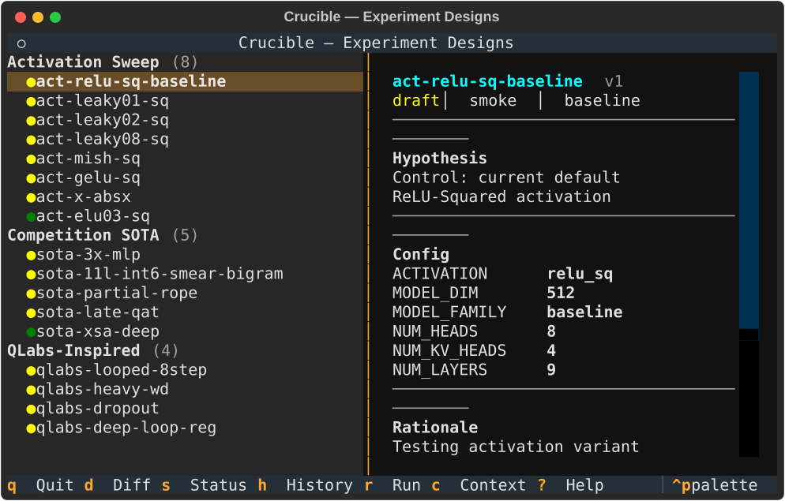
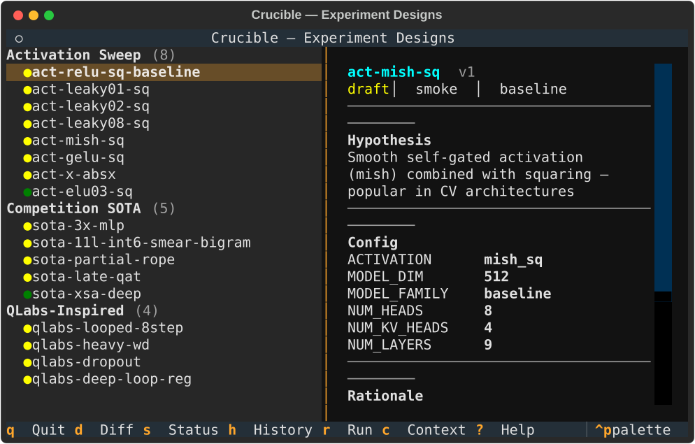

# Crucible

**The open research operating system for autonomous ML discovery on commodity GPUs** — where hypothesis synthesis, fleet orchestration, and judge-separated loops compose into one closed loop.

Short version: *for labs that can't afford DeepMind's compute but want Sakana's autonomy.*

Crucible combines LLM-driven hypothesis generation (via an orchestrator contract — no LLM keys baked in), fleet orchestration on rental GPUs, GIANTS-style cross-finding synthesis, judge-separated LM-as-judge loops, versioned experiment designs, and an interactive TUI — all accessible over MCP so AI agents can design, run, and iterate on experiments autonomously. See [`positioning`](positioning) for the competitive landscape and what Crucible explicitly is NOT.



---

## Key Features

### Versioned Experiment Designs
Every experiment design is a human-readable YAML file tracked with full version history. Agents iterate on designs, compare versions, and promote winners — all through MCP tools or the interactive TUI.

### 200+ MCP Tools
Agents interact with Crucible over the Model Context Protocol. Browse experiments, generate hypotheses, design batches, compose architectures declaratively, run tree search (UCB1 / GRPO / agent-directed) over experiments, mine cross-project findings for GIANTS-style synthesis hypotheses, and trigger fleet runs — all without leaving the conversation.

### Interactive TUI
A Textual-powered terminal app for browsing designs, viewing diffs, cycling statuses, and exploring research context. Launch with `crucible tui`.



### Fleet Orchestration
Provision RunPod or SSH nodes, sync code, enqueue experiments, and collect results. Multi-tier promotion system: smoke (60s) to proxy (30m) to medium (1h) to promotion (2h).

### Autonomous Research Loop
Orchestrator-driven hypothesis generation, batch design, fleet execution, and reflection. Any LLM (Claude, GPT, Gemini, Llama via your runner) can drive the loop via the `research_request_prompt` / `research_submit` contract — Crucible carries no LLM keys. Judge-separation enforced: reward and eval judges must be different models in different families.

---

## Quick Start

```bash
# Install
pip install crucible-ml[all]

# Initialize project
crucible init

# Launch TUI
crucible tui

# Start MCP server (for Claude integration)
crucible mcp serve

# Run a smoke experiment
crucible run experiment --preset smoke
```

---

## Architecture

```
src/crucible/
  core/          Config, I/O, types, logging, version store
  fleet/         Provider-abstracted fleet (RunPod, SSH)
  runner/        Experiment execution, output parsing, presets
  training/      Training backends (torch, generic) — modality-agnostic
  models/        Model zoo — components, architectures, declarative composer
  researcher/    LLM-driven autonomous research loop
  analysis/      Leaderboard, sensitivity, Pareto frontier (N-D)
  data/          Manifest-driven HuggingFace data pipeline
  mcp/           MCP server (200+ tools for Claude agents)
  tui/           Interactive terminal UI (Textual)
  cli/           CLI entry points
```

---

## Pages

- [Positioning](positioning) — Where Crucible sits vs Sakana / FutureHouse / DeepMind, and what it explicitly is NOT
- [Getting Started](getting-started) — Installation, project setup, first experiment
- [YOLO MCP Demo](yolo-mcp-demo) — Empty-dir external-project fine-tuning via MCP
- [TUI Guide](tui) — Interactive design browser walkthrough
- [MCP Tools Reference](mcp-tools) — All 200+ tools with schemas
- [Architecture](architecture) — System design and module overview
- [Plugins](plugins) — How to write architecture plugins
- [Modality Guide](modality-guide) — Training diffusion models, world models, and beyond
- [Harness Optimization](harness-optimization) — Evolve memory systems / agent scaffolds via Pareto frontiers
- [Judge Separation](judge-separation) — Why reward and eval judges must come from different families
- [Roadmap](roadmap) — What's done, what's next
