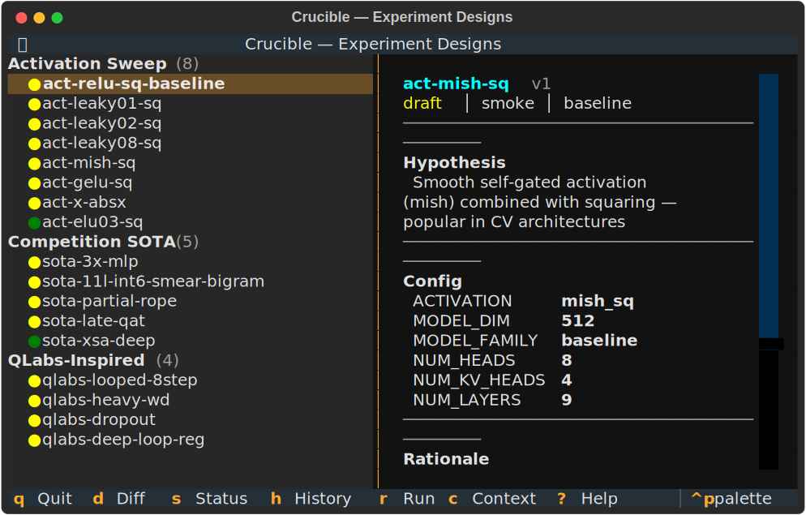
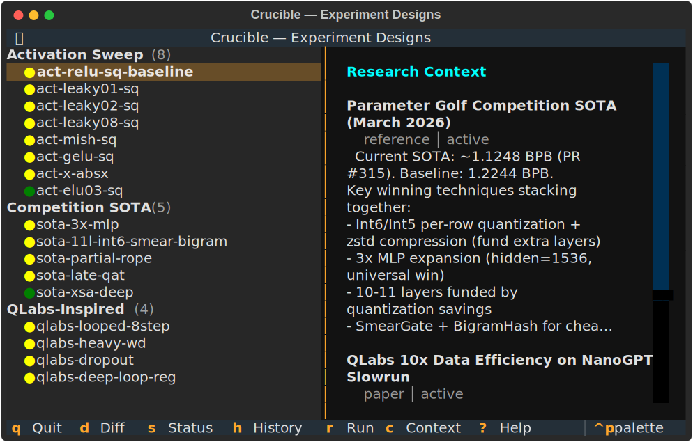
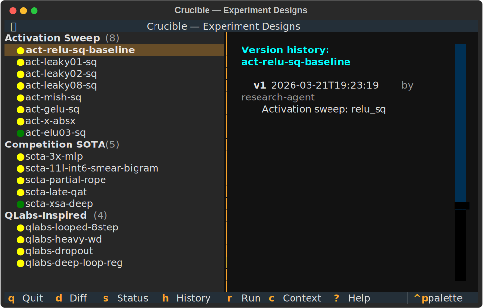

# Interactive TUI Guide

Launch the TUI:
```bash
crucible tui
```


## Layout

- **Left pane**: Design list grouped by batch (Activation Sweep, Competition SOTA, QLabs-Inspired)
- **Right pane**: Detail view for the selected design
- **Bottom bar**: Design counts by status
- **Footer**: Available keybindings

## Navigation

| Key | Action |
|-----|--------|
| `Up/Down` or `j/k` | Navigate designs |
| `Enter` | Select design |
| `d` | Diff mode — compare two designs |
| `s` | Cycle status (draft > ready > running > completed > archived) |
| `h` | Version history |
| `c` | Research context view |
| `r` | Run design (fleet) |
| `?` | Help overlay |
| `q` | Quit |

## Design Detail

Each design shows:
- **Name + version** with status color (yellow=draft, green=ready, blue=running)
- **Config table** with aligned key-value pairs
- **Hypothesis** — what the experiment tests
- **Rationale** — why this design exists
- **Tags** and linked run IDs



## Diff Mode

Press `d` to enter diff mode:
1. First press marks the **anchor** design
2. Navigate to another design and press `d` again
3. Shows a structured diff with changes highlighted

Config diffs are expanded key-by-key — you see exactly which env vars changed.


## Research Context

Press `c` to view research context entries — papers, findings, and ideas that inform experiment design.



## Version History

Press `h` to see the full version history for the selected design, including who made each change and when.



## Status Lifecycle

Designs follow this lifecycle:

```
draft  -->  ready  -->  running  -->  completed  -->  archived
  ^                        |
  |    (back to draft)     |
  +------------------------+
```

Press `s` to cycle through statuses. Each change creates a new version in the store.

## Screenshots

Generate SVG screenshots for documentation:
```bash
crucible tui --screenshots docs/images
```

This runs the TUI headless, captures 5 key states, and saves them as SVG files.
